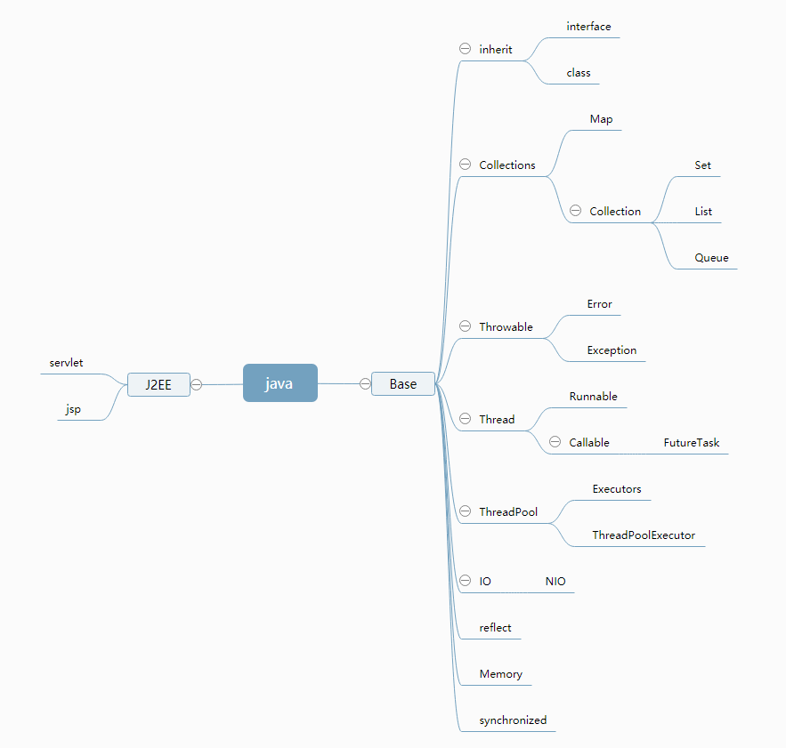

# java基础学习日记

  
  
#### 日志作用：
  现在阶段学习记录和之后对忘了的知识点的复习。
  
    1. 记录
    2. 备忘
  
  

#### 日志版本管理的初想：
  合并、发布、里程碑。
  
  作用和区别：
  
    1. 对github相关知识点的学习，什么是合并，什么是发布。什么是里程碑
    2. 当第上一个版本写完，需要修改时的版本管理，这比较于写在微博更加方便查看知识点的增加，更便于总结
    
# 章节目录
  
 [继承](https://github.com/idler-d/java-master/tree/master/src/main/java/com.idler.java/a_inheir)